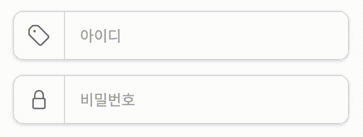
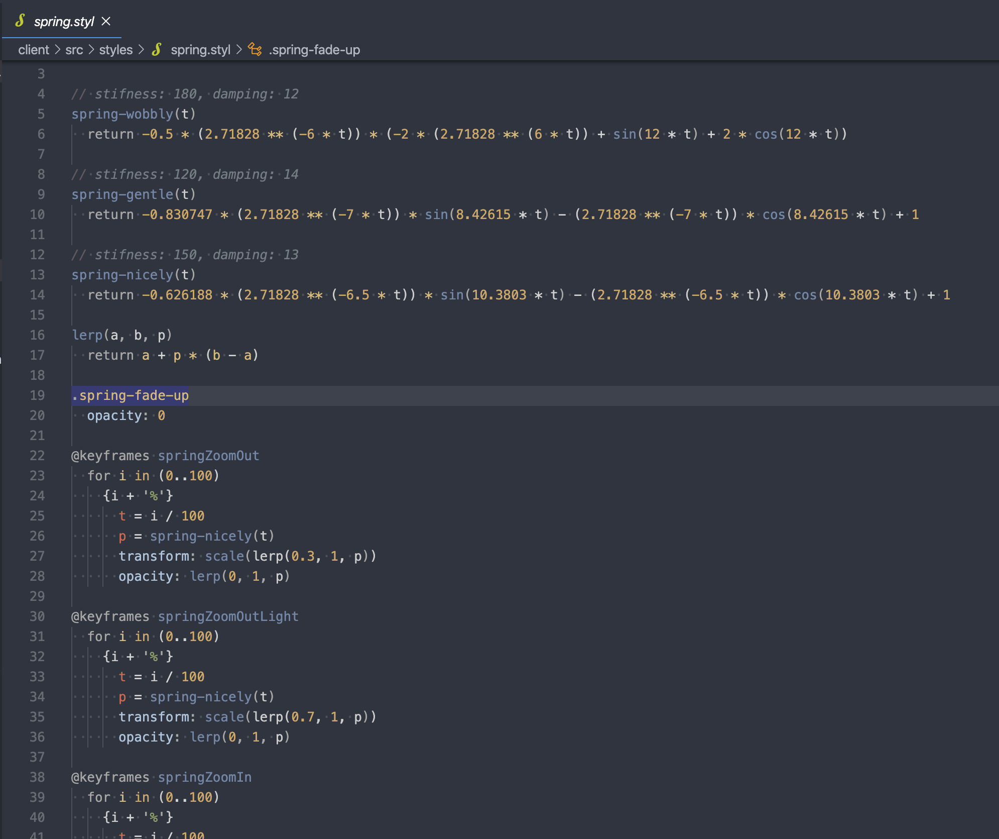
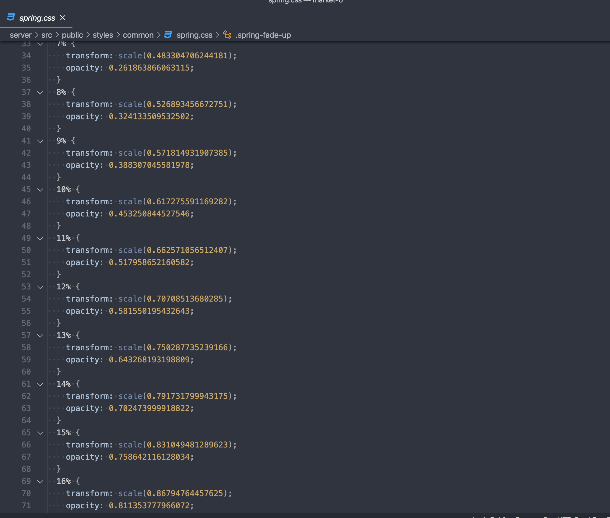

# Animation

이번 [프로젝트](https://github.com/woowa-techcamp-2020/market-6)를 통해서 CSS로 애니메이션을 어떻게 구현하는 지 [해민](https://github.com/jhaemin)~~갓~~님께 배웠는데, 저처럼 궁금하신 분들이 많아서 제가 공부한 내용을 공유해 드리겠습니다. 일단 깃헙 리드미에 내용이 있지만, 내용으로는 잘 와 닿지 않으니 제가 했던 것 처럼 실제로 구현을 하면서 내용을 익히겠습니다. ~~이론은 해민님이 설명해주시겠죠...~~

### 애니메이션이란?

애니메이션, 동적 UI는 많은 분들이 기억하시는 오토바이가 튀어나오는 장면처럼 `예쁘고 멋지기` 위해 구현한다고 생각하시는데, 애니메이션 효과를 통해 UX 또한 향상시킬 수 있습니다.

<p align="center">
  
</p>

---

### 실습 or 학습

자 그럼 일단 이 녀석 부터 함께 구현해 보시겠습니다. 이 친구는 기본적으로 들어오는 인풋 값이 올바른 경우에 오른쪽 상단에 `초록색 체크 마크`를 띄우고, 왼쪽 아이콘의 `배경과 아이콘 색` 또한 변경됩니다. 반면, 옳지 않은 값이 들어온 경우에는 왼쪽 아이콘의 배경과 아이콘 색이 붉은 색으로 변경되고, 인풋 창이 늘어나는 모션과 함께 붉은 색의 에러 메시지 창이 뜨게 됩니다. 또한 자세히 살펴보시면, 각각의 border 색 또한 붉은 색으로 변경됩니다. ~~생각보다 구현할 것이 많습니다.~~

실제로 구현해 보실 수 있게 간소화한 파일 만을 남겨두었고 해당 부분의 css를 찾아보는 묘미를 즐겨보세요. ~~정답을 보시면서,~~ 실습해 보시면 될 것 같아요!, vscode의 `live server` 익스텐션을 까시면 훨씬 편하게 개발하실 수 있습니다. 서버를 켜지 않았기 때문에, 아이디 부분에서 네트워크 에러가 발생합니다. 실망하지 마시고...다른 인풋 들로 테스트를 해보시면 좋을 것 같아요.

### Transition
`styles/common/input.css` 파일을 보시면, 아래와 같은 코드를 보실 수 있는데, 이벤트 리스너에 따라 valid한 값이 들어오면 `valid-input` 이라는 클래스를, invalid한 값이 들어오면 `invalid-input` 클래스를 추가하기 때문에 각각의 상황에 맞는 변화 값을 입력해 두었습니다.

```css
.input-wrapper {
	...
  max-width: var(--input-width);
  height: var(--input-height);

	...
  border: 1px solid var(--border-gray);

  transition: height var(--transition-time = 300ms) cubic-bezier(0.74, 0.02, 0.14, 1),
    border-color var(--transition-time) ease,
}

.input-wrapper.invalid-input {
  height: var(--input-large-height);
  border-color: var(--red);
}
```

간소화된 코드를 보실 수 있는데, 여기서 집중하실 내용은 `height`, `border-color` , 그리고 `transition`입니다. transition이 위와 같이 세팅 되어있므면, 해당 엘리먼트의 첫번째 속성 값인 `height` 값이 변할 때 두번째 인자로 들어온 시간 동안, 세번 째 인자인 효과에 따라 변화하게 됩니다. 마찬가지로 `border-color` 또한 `invalid-input` 클래스가 추가되면, —border-gray 라는 색상에서 —red색상으로 변하겠죠? 이상 구현끝.

물론 invalid한 인풋이 아닌 valid한 인풋이 들어왔을 때도 위와 같이 transition에 변하게 될 값을 추적 시켜 놓으면, `valid-input` 클래스가 추가된 엘리먼트의 해당 값이 변화하는 순간에 에니메이션이 동작하겠죠?

```css
.input-wrapper .input-icon {
  ...
  color: var(--gray);
	...
  transition: color var(--transition-time) ease;
}

.input-wrapper.valid-input .input-icon {
  background-color: var(--light-green);
  color: var(--green);
}
```

코드의 내용을 보시면, input-icon은 `valid-input` 이라는 클래스가 추가 되었을 때, `color`가 —gray에서 —green으로 변하게 됩니다. css 여러곳을 살펴보시면서, transition이 어디에 어떻게 쓰이는지 찾아보시는 재미는 여러분께 남겨드리고 저는 다음으로 transform에 대해 설명드릴게요.

### Transform
트랜스폼은 엘리멘트의 이동(translate), 회전(rotate), 확대축소(scale), 비틀기(skew) 효과를 부여하기 위한 함수를 제공하는데, 기본적으로 애니메이션 효과를 제공하지는 않기 때문에 애니메이션 효과는 적용되지 않습니다.

<p align="center">
  
</p>


프로젝트 내에서 사용된 곳을 찾아보자면, 가입 화면 최상단에 위치한 뒤로가기 버튼에 마우스를 올려보시면 화살표과 왼쪽으로 이동하는 것을 볼 수 있습니다.~~애니메이션 효과가 있는데 혹시 사기꾼~~ hover라는 이벤트에 따라 엘리멘트 자체가 이동(translate) 한 경우입니다. 코드로 보면 참 쉽다...는 생각이 듭니다

```css
.go-back:hover .icon {
  transform: translateX(-30%);
}
```

### Animation
`transition`은 CSS 속성 값이 변화할 때, 속성 값의 변화가 일정 시간에 걸쳐 일어나도록 하는 것이고, `transform`은 엘리멘트의 형태 자체를 변형시키는 것이라는데, 그럼 과연 우리의 오토바이는 어떻게 등장한 것일까요? 여기서 바로 `animation`이 등장하게 됩니다.

> 애니메이션(Animation) 효과는 HTML 요소에 적용되는 CSS 스타일을 다른 CSS 스타일로 부드럽게 변화시킨다. 애니메이션은 애니메이션을 나타내는 CSS 스타일과 애니메이션의 sequence를 나타내는 복수의 키프레임(@keyframes) 들로 이루어진다. 출처: [css3 animation](https://poiemaweb.com/css3-animation)

위의 정의에 따르면, transition이 시작 값을 기반으로 부여한 효과에 따라 끝 값을 향해 변하는 애니메이션을 주는 `단순한` 역할을 한다면, `animation` 은 훨씬 복잡한 애니메이션을 디테일하게 구현하는 데 필요해 보입니다. ~~그럼요 오토바이는 훨씬 디테일 하게 움직여야지요.~~

```css
@keyframes ride {
  0% {
    transform: translateX(calc(100% + 100px)) rotate(20deg);
  }
  100% {
    transform: translateX(0) rotate(0deg);
  }
}
```

보통 훨씬 디테일한 움직임은 바로 이 `@keyframes`에 의해 효과를 정의합니다. 0%에서 100%로 변하는 동안에 엘리멘트가 어떻게 변할지(transform)을 통해서  그 모양을 세부적으로 조정하게 됩니다. 이렇게 정의한 ride효과를 `animation` 속성 값의 첫 인자로 아래와 같이 넣어주면?

```css
.aside img {
  ...
  animation: ride 1.5s ease forwards;
}
```

오토바이가 날아오게 됩니다. ~~끝~~
<p align="center">
  
</p>

흠, 그런데 위의 `ride` keyframe을 살펴보면 0%에서 100%까지 변하는거면 사실상 `transition`이랑 다른 거 없는 거 아닌가 생각이 드실 수도 있는데, [스프링 에니메이션](https://miro.medium.com/max/1200/1*nnmBb7kGxrerUQChlAngJw.gif) 과 같은 훨씬 복잡한 애니메이션을 구현하기 위해서는 각 단계마다 세부적이게 적어주어야 합니다. ~~부디 해민님도 가져오신거길... 바라는~~ 스프링 애니메이션을 구현한 코드는 stylus라는 언어를 이용해 만들 수 있는데, 사진으로 대체합니다. 좌측(위)의 코드를 stylus로 컴파일 하게 되면, 우측(아래)의 css코드로 변환시켜 줍니다!

<p align="center">
  
  
</p>

0에서 100 퍼센트 까지 아주 세세하고 디테일하게 엘리먼트가 어떻게 변화할지에 대한 css기반의 keyframe을 생성해 준답니다. 아니 그럼 이렇게 복잡한 에니메이션이 어디에 구현 되었냐구요? 다시 시작으로 돌아가서, 올바른 값이 들어왔을 때, 우측에 생성되는 초록색 체크 기억하시나요?

<p align="center">
  
</p>

```css
.input-wrapper.valid-input .check .icon {
  animation: springZoomOut 0.6s linear forwards;
}
```

네, 바로 이 친구가 이 모진 시련을 겪고 태어난 아이입니다. 오토바이보다 더 많은 노력이 들어갔는데, ~~알아봐주시는 분들이 적...~~  그 만큼 훌륭하게 유저들의 사용자 경험을 향상 시켰다고 생각합니다. 예쁜데 훌륭한 역할까지 수행한 우리의 체크 아이콘~~과 창조주 해민갓님께~~이 영광을 돌립니다.

사실 저도 이렇게까지 CSS를 다뤄본 경험이 없었는데, 이번에 해민님과 함께 팀을 하면서 많은 것을 배웠습니다. 저도 배워서 했으니, 여러분들도 꼭 한번 도전해보세요. ~~생각보다~~ 많이 재밌습니다. 열심히 공부해서 ~~다음에는 모두다 해민님을 이겨보아요~~
아름다운 UI/UX를 자유자재로 구현할 수 있는 상향평준화 된 우테켐 3기 프론트 개발자가 되어보아요 :)
